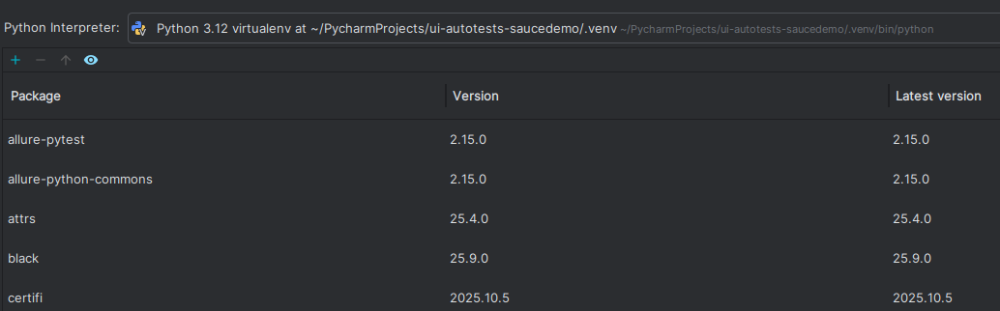

create own env-- python3 -m venv my_venv
playwright install --- for browsers
activate env -- source my_venv/bin/activate

install formater -- pip install black

ctr+alt+s open settings -- need interpetener, where installed all staff

pip install playwright
